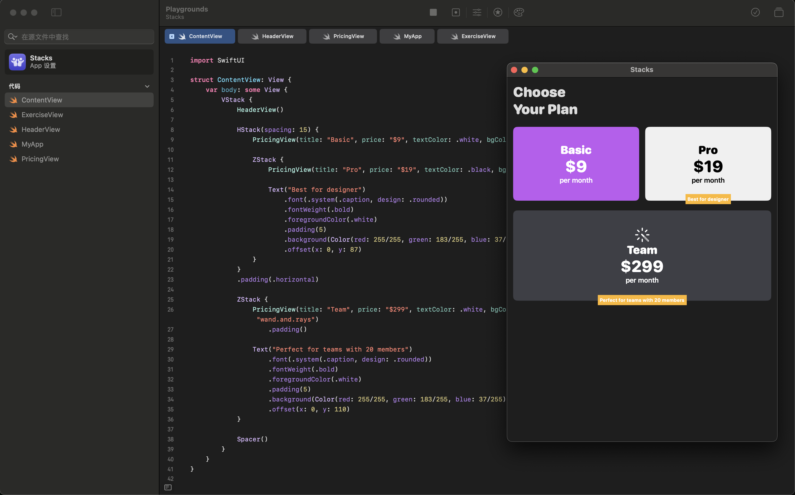

# Playgrounds

Welcome to the Swift Playgrounds Examples repository! This collection of Swift Playgrounds is designed to support classroom teaching, providing a fun and interactive way for students to learn Swift programming. Whether you're introducing beginners to basic programming concepts or helping advanced learners tackle more complex projects, these examples are crafted to enhance the educational experience.



## Getting Started

1. **Clone the Repository**: 
   ```bash
   git clone https://github.com/Sxy623/Playgrounds.git
   ```

2. **Open in Swift Playgrounds**: Use Apple's Swift Playgrounds app on iPad or Mac to explore the examples.

## License

This project is licensed under the MIT License. See the [LICENSE](LICENSE) file for more details.

## Contact

For questions or suggestions, feel free to open an issue or contact me directly at [shenxinyi@zju.edu.cn](mailto:shenxinyi@zju.edu.cn).
